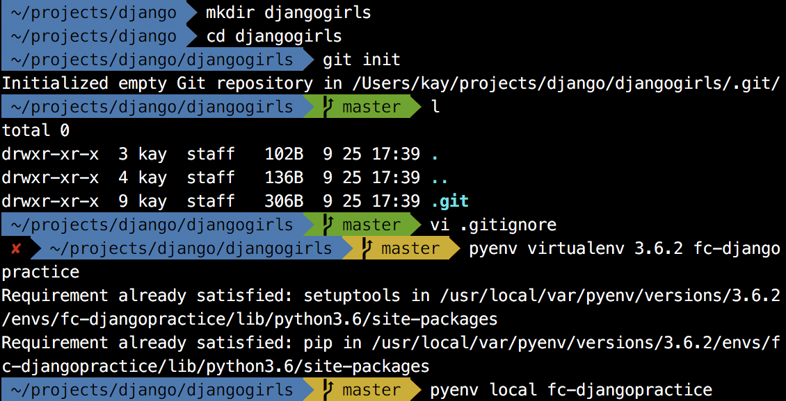
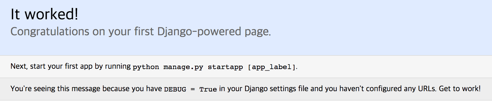

- git hub에 저장소 추가 후 로컬 git에 remote 저장소 추가.
- py .로 pycharm 열어서 interpreter 설정 후 닫기.
- pip install django
- pip freeze > requirement.txt
- 후에 pip install -r requirement.txt로 쉽게 설치 가능.
- 이름 바꾸기 mv djangogirls djangogirls_practice
```
django-admin startproject djangogirls(다른 이름 가능)
python manage.py migrate
```
-> db.sqlite3로 저장됨.
```
python manage.py runserver
127.0.0.1:8000
```

