manage.py가 있는 폴더에서

```
python manage.py runserver
```

라고 입력하면

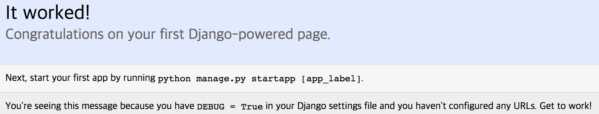


config 폴더 안에 settings.py에서

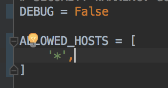

처럼 하면

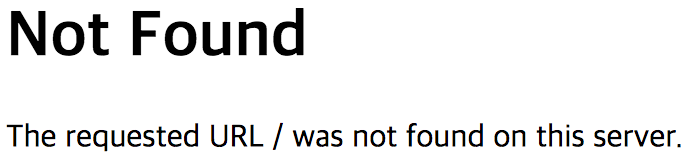


```
./manage.py startapp blog
```

라고 입력하면

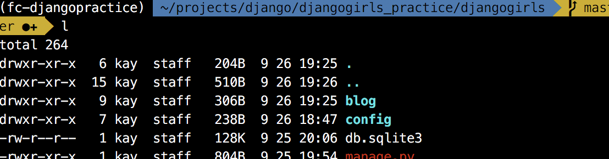

블로그 폴더가 생김.

config/settings.py/installed app에 `'blog',`추가함으로써 애플리케이션을 사용하겠다고 장고에 알려줌.

blog/models.py에 model 객체를 선언해서 모델을 만듦.


```
class Post(models.Model):
    author = models.ForeignKey(settings.AUTH_USER_MODEL)
    title = models.CharField(max_length=100)
    content = models.TextField(blank=True)
    created_date = models.DateTimeField(auto_now_add=True)
    published_date = models.DateTimeField(blank=True, null=True)
```

> 빨간 밑줄은 import (alt+enter)

> class 맨 앞은 대문자

> models.Model 주의

manage.py 가 있는 폴더에서 ```./manage.py makemigrations blog```입력

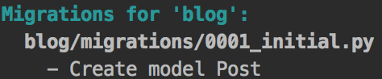

```./manage.py migrate blog```입력하면 blog application에 있는 아직 미적용된 migration이 database에 적용됨.

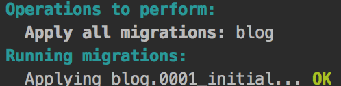

database로 확인하면 ```blog.post```가 table에 추가된 것을 볼 수 있음.

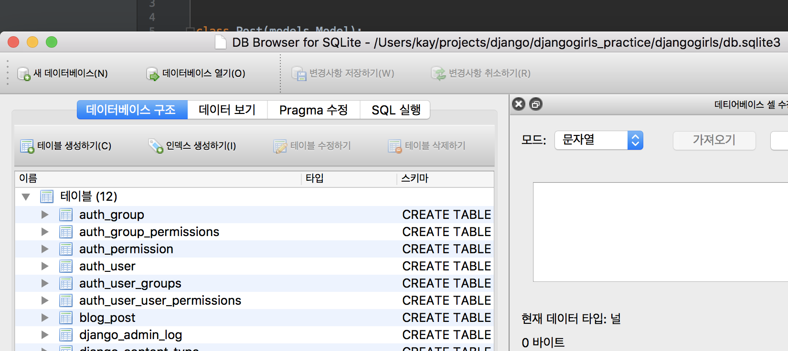

눌러보면 title, content 등 확인됨.

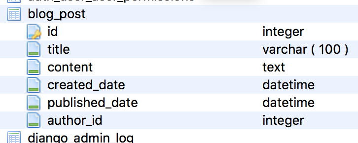


blog/admin.py에

```
from .models import Post

admin.site.register(Post)
```

입력.

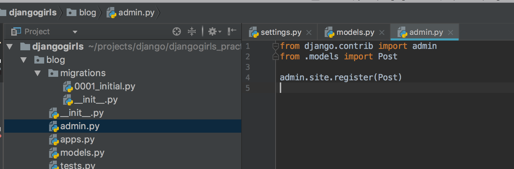

* 항상 terminal 한쪽에 runserver

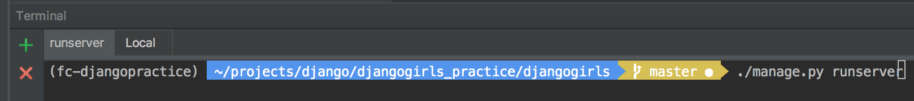

localhost:8000/admin으로 접속 후 확인 가능.

terminal 창에 ./manage.py createsuperuser 입력하면 관리자 계정 생성.

자동으로 나와있는 아이디와 이메일은 enter키로 넘어가고 비밀번호 설정.

관리자 페이지로 로그인 가능.

database 상에서 확인.

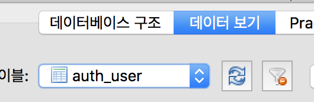