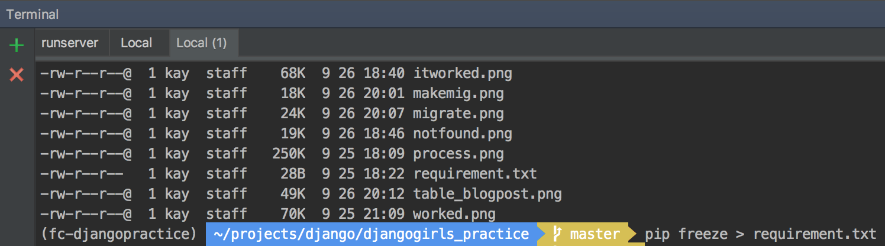
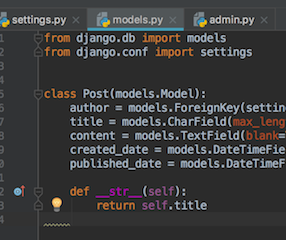
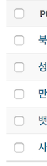
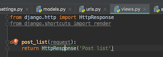
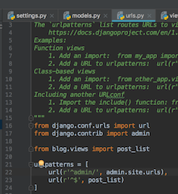

```terminal```창에서 ```pip install ipython django_extensions```로 두가지를 한번에 설치.

```./manage.py shell_plus``` 실행.
terminal 다른 창에서 pip freeze로 저장.



제목이 이렇게 나옴.




```http://127.0.0.1:8000/```로 접속했을 때
홈 화면이 나오도록.


